# OMNI-GRID PAKISTAN — Master Platform Blueprint

> **The Definitive Engineering Document**
> Pakistan's First Omnichannel Ad-Tech Infrastructure Platform
> Target Market: PKR 20,000+ Crore ($720M+) Advertising Industry

---

## Part 1: Honest Assessment of Current Build

### What Exists Today (The Truth)

After deep inspection of every file in the codebase, here is an **honest, brutal assessment**:

| Layer | Current State | Verdict |
| :--- | :--- | :--- |
| **Authentication** | `AuthContext.tsx` stores role in `localStorage`. No real login, no passwords, no email verification, no sessions. | ❌ **Fake auth. Zero security.** |
| **Database** | Schema exists in `schema.ts` (6 domain tables). D1 migrations never applied. No seed data. | ⚠️ **Schema exists but empty DB.** |
| **Backend API** | 9 route files exist. Basic CRUD for assets, campaigns. No input validation. No error handling. | ⚠️ **Skeleton only. Not production.** |
| **Frontend Pages** | 10 pages exist. All use **hardcoded mock data**. Zero API calls to backend. | ❌ **100% static mockups.** |
| **Frontend → Backend** | Frontend on `:5178`. Backend on `:8787`. **No connection between them.** | ❌ **Two unlinked apps.** |
| **Payments** | Stripe route file exists but no Pakistani payment gateway (JazzCash, Easypaisa, Raast). | ❌ **No real payment flow.** |
| **File Uploads** | R2 storage route exists. Frontend has no upload UI connected to it. | ❌ **Not wired.** |
| **Maps & Location** | No map library. No GPS integration. Billboard locations are text strings. | ❌ **No actual map.** |
| **Notifications** | Toast UI exists (cosmetic). No email, SMS, push, or WebSocket notifications. | ❌ **Cosmetic only.** |
| **Admin Panel** | Hardcoded approval queue. No real CRUD. No real data. | ❌ **Static mockup.** |
| **Mobile PWA** | `manifest.json` and `sw.js` exist. No offline data sync. No camera integration. | ⚠️ **Shell only.** |
| **Testing** | 1 test file in backend (`index.test.ts`). Zero frontend tests. | ❌ **Untested.** |

### Root Problem

The previous AI tried to build everything in one pass — adding UI widgets, tax calculators, vehicle classifiers, FBR certificates — **but none of it connects to real data or real APIs**. Every page is a beautifully styled mockup with hardcoded numbers. The frontend and backend are two separate apps that don't talk to each other.

**What needs to happen**: Rebuild module-by-module, where each module is a complete vertical slice (database → API → frontend → tests) before moving to the next.

---

## Part 2: Platform Architecture

### System Architecture Diagram

```mermaid
graph TB
    subgraph "Frontend PWA (React + Vite)"
        A[Landing & Onboarding]
        B[Inventory Explorer + Map]
        C[Campaign Builder]
        D[Advertiser Dashboard]
        E[Asset Owner Dashboard]
        F[Micro-Earner PWA]
        G[Creator Hub]
        H[Admin Control Panel]
        I[Analytics & Reporting]
    end

    subgraph "Edge Backend (Cloudflare Workers + Hono)"
        J[Auth API - Better Auth]
        K[Assets API]
        L[Campaigns API]
        M[Bookings API]
        N[Payments API]
        O[Verification API]
        P[Notifications API]
        Q[Analytics API]
        R[Admin API]
    end

    subgraph "Data Layer"
        S[(D1 SQLite - Primary DB)]
        T[(KV - Session Cache)]
        U[(R2 - File Storage)]
        V[(Vectorize - AI Search)]
    end

    subgraph "External Services"
        W[JazzCash / Easypaisa API]
        X[Mapbox / Google Maps]
        Y[Twilio SMS / Email]
        Z[OpenWeather API]
    end

    A & B & C & D & E & F & G & H & I --> J & K & L & M & N & O & P & Q & R
    J & K & L & M & N & O & P & Q & R --> S & T & U & V
    N --> W
    B --> X
    P --> Y
    C --> Z
```

### User Roles & Permissions Matrix

| Role | Can Do | Cannot Do |
| :--- | :--- | :--- |
| **Advertiser** | Browse inventory, build campaigns, book assets, upload creatives, view analytics, make payments | Approve assets, manage users, view other advertisers' data |
| **Asset Owner (Vendor)** | List assets, set pricing, view bookings on their assets, track revenue, upload NOC documents | Book other people's assets, access admin panel |
| **Micro-Earner (Shopkeeper/Driver)** | View assigned verification tasks, take geotagged photos, submit proofs, track earnings, request payouts | List assets, build campaigns, access admin |
| **Creator (Influencer)** | Set rates, receive brand briefs, accept/reject jobs, submit content proofs, track earnings | List physical assets, access admin |
| **Enterprise** | Everything Advertiser can do + multi-user org management + TV/broadcast booking + advanced analytics | Manage platform users, approve assets |
| **Super-Admin** | Full platform control: approve/reject assets, manage all users, view all financials, system config | N/A — full access |

---

## Part 3: Module-by-Module Roadmap

> Each module is a **complete vertical slice**: Database Schema → API Endpoints → Frontend UI → Tests.
> Modules are ordered by dependency — each one builds on the previous.

---

### 🔷 PHASE 1: Foundation (Modules 1–8)
*Goal: Real authentication, real database, real data flowing from backend to frontend.*

---

#### Module 1: Project Infrastructure & Dev Environment
**Priority**: 🔴 Critical | **Effort**: 1 day

- [ ] Configure `wrangler.jsonc` with all bindings (D1, KV, R2, AI)
- [ ] Set up environment variables (`.dev.vars`) for local secrets
- [ ] Configure frontend API base URL pointing to backend (`http://localhost:8787`)
- [ ] Set up a shared API client utility in frontend (`src/lib/api.ts`)
- [ ] Add `concurrently` to run both frontend + backend with single `npm run dev`
- [ ] Add `.env.example` with all required keys documented
- [ ] Set up Prettier + ESLint config for consistent code style

**Acceptance Criteria**: `npm run dev` starts both frontend (`:5173`) and backend (`:8787`). Frontend can `fetch('/api/health')` and get a response.

---

#### Module 2: Authentication & User Management
**Priority**: 🔴 Critical | **Effort**: 3 days

**Database**:
- [ ] `users` table (exists — needs migration applied)
- [ ] `sessions` table (exists — needs migration applied)
- [ ] `accounts` table (exists — needs migration applied)
- [ ] `verifications` table (exists — needs migration applied)

**Backend API**:
- [ ] `POST /api/auth/sign-up/email` — Register with email + password
- [ ] `POST /api/auth/sign-in/email` — Login with email + password
- [ ] `POST /api/auth/sign-out` — Logout (destroy session)
- [ ] `GET /api/auth/session` — Get current session/user
- [ ] `POST /api/auth/forgot-password` — Password reset email
- [ ] Google OAuth sign-in flow
- [ ] Phone number OTP verification (Twilio or local SMS gateway)
- [ ] Role assignment during signup (advertiser, owner, earner, creator)
- [ ] Admin-only user management endpoints

**Frontend**:
- [ ] Real login page (`/login`) with email + password form
- [ ] Real signup page (`/signup`) with role selection
- [ ] Password reset page (`/forgot-password`)
- [ ] Protected route middleware (redirect to login if no session)
- [ ] User profile dropdown in navigation (name, email, avatar)
- [ ] Logout button that actually destroys the session
- [ ] Session persistence across page reloads
- [ ] Replace fake `AuthContext` with real Better-Auth session client

**Acceptance Criteria**: A user can register, login, see their name in the nav, refresh the page and stay logged in, and logout. Unauthenticated users are redirected to `/login`.

---

#### Module 3: Organization & Multi-Tenancy
**Priority**: 🟡 High | **Effort**: 2 days

**Database**:
- [ ] `organizations` table (exists — needs migration)
- [ ] `memberships` table (exists — needs migration)
- [ ] Add `organizationId` foreign key to relevant tables

**Backend API**:
- [ ] `POST /api/organizations` — Create new organization
- [ ] `GET /api/organizations/:id` — Get org details
- [ ] `POST /api/organizations/:id/invite` — Invite member by email
- [ ] `POST /api/organizations/:id/members` — Accept invite / join
- [ ] `DELETE /api/organizations/:id/members/:userId` — Remove member
- [ ] `PUT /api/organizations/:id/members/:userId/role` — Change member role

**Frontend**:
- [ ] Organization settings page (`/settings/organization`)
- [ ] Team members list with invite functionality
- [ ] Role management (owner, admin, member)
- [ ] Organization switcher in nav (for users in multiple orgs)

**Acceptance Criteria**: An advertiser can create an org "Pepsi Pakistan", invite team@pepsi.com, that person joins and sees the same campaign data.

---

#### Module 4: Asset Inventory — Complete CRUD
**Priority**: 🔴 Critical | **Effort**: 4 days

**Database**:
- [ ] `ad_assets` table (exists — needs migration + additional columns)
- [ ] Add: `nocDocumentUrl`, `nocStatus`, `nocExpiryDate`, `hardwareType`, `screenResolution`, `luminanceNits`, `physicalWidth`, `physicalHeight`, `facingDirection`, `elevationMeters`, `nearestLandmark`, `monthlyMinimumBookingDays`, `isExclusive`
- [ ] Add: `ad_asset_images` table (multiple images per asset)
- [ ] Add: `ad_asset_availability` table (date ranges when available)

**Backend API**:
- [ ] `GET /api/assets` — List with pagination, filtering (city, category, price range, traffic, NOC status, availability dates)
- [ ] `GET /api/assets/:id` — Full asset detail with images, availability calendar
- [ ] `POST /api/assets` — Create new asset (owner only, requires auth)
- [ ] `PUT /api/assets/:id` — Update asset details (owner only)
- [ ] `DELETE /api/assets/:id` — Soft-delete asset (owner only)
- [ ] `POST /api/assets/:id/images` — Upload images to R2
- [ ] `POST /api/assets/:id/noc` — Upload NOC document to R2
- [ ] `GET /api/assets/:id/availability` — Get booking calendar
- [ ] Input validation with Zod on every endpoint
- [ ] KV cache invalidation on writes

**Frontend**:
- [ ] Asset listing page with real data from API (not hardcoded)
- [ ] Advanced filter sidebar: city, category, price range slider, traffic range, NOC status, date availability
- [ ] Asset detail modal pulling real data from `GET /api/assets/:id`
- [ ] Asset registration form for owners (multi-step wizard)
- [ ] Image upload with drag-and-drop (connects to R2)
- [ ] NOC document upload (PDF viewer)
- [ ] Availability calendar (month view, shows booked/available dates)
- [ ] Loading skeletons while data fetches
- [ ] Empty states when no results match filters
- [ ] Pagination (infinite scroll or numbered pages)

**Acceptance Criteria**: An owner registers a billboard with photos. An advertiser searches, finds it, sees real photos, real pricing, real availability calendar, and real NOC status — all from the database.

---

#### Module 5: Interactive Map Integration
**Priority**: 🟡 High | **Effort**: 3 days

**Backend API**:
- [ ] `GET /api/assets/geo` — Return assets with lat/lng for map clustering
- [ ] Geospatial query support (find assets within X km radius of a point)

**Frontend**:
- [ ] Integrate Mapbox GL JS (or Leaflet as free alternative)
- [ ] Map view showing all assets as pins with category-colored markers
- [ ] Cluster markers when zoomed out (declutter)
- [ ] Click pin → show asset preview popup with photo, price, traffic
- [ ] Click popup → open full asset detail modal
- [ ] Search bar with city autocomplete (Lahore, Karachi, Islamabad, etc.)
- [ ] "Near me" button using browser geolocation
- [ ] Toggle between map view and list/grid view
- [ ] Draw-to-select: draw a rectangle on map to filter assets in that area
- [ ] Heatmap overlay showing traffic density per area
- [ ] Street View integration (Google Street View embed for location verification)

**Acceptance Criteria**: User opens the Explore page, sees a map of Pakistan with billboard pins. Clicks a pin, sees real asset data. Can search by city and filter by category on the map.

---

#### Module 6: Creative Upload & Media Library
**Priority**: 🟡 High | **Effort**: 2 days

**Database**:
- [ ] `creatives` table: `id`, `campaignId`, `userId`, `fileName`, `r2Key`, `mimeType`, `width`, `height`, `fileSizeMb`, `format` (JPEG/PNG/MP4/PDF), `status` (DRAFT/APPROVED/REJECTED), `adminNotes`
- [ ] `creative_versions` table: track revisions

**Backend API**:
- [ ] `POST /api/creatives/upload` — Upload creative file to R2 (with presigned URL flow)
- [ ] `GET /api/creatives` — List user's creatives
- [ ] `DELETE /api/creatives/:id` — Delete creative
- [ ] `PUT /api/creatives/:id/approve` — Admin approve
- [ ] File type validation (only JPEG, PNG, MP4, PDF)
- [ ] File size limits (50MB max for video, 10MB max for image)
- [ ] Auto-generate thumbnail for video uploads

**Frontend**:
- [ ] Media library page showing all uploaded creatives as a grid
- [ ] Drag-and-drop upload zone
- [ ] Upload progress bar
- [ ] Image preview with dimensions overlay
- [ ] Video preview player
- [ ] Creative specifications checker (warn if resolution too low, wrong aspect ratio, etc.)
- [ ] Print spec sheet generator based on selected billboard dimensions

**Acceptance Criteria**: Advertiser uploads a creative file, sees it in their media library, can attach it to a campaign. Admin can approve or reject with notes.

---

#### Module 7: Booking Engine & Reservation System
**Priority**: 🔴 Critical | **Effort**: 5 days

**Database**:
- [ ] `bookings` table: `id`, `assetId`, `advertiserId`, `campaignId`, `startDate`, `endDate`, `durationDays`, `daypartingSlot`, `isExclusive`, `baseRatePkr`, `discountPct`, `exclusivityFeePkr`, `taxPstPkr`, `whtPkr`, `escrowFeePkr`, `totalAmountPkr`, `paymentStatus`, `bookingStatus` (PENDING/CONFIRMED/ACTIVE/COMPLETED/CANCELLED), `approvedByAdminId`, `createdAt`
- [ ] `booking_status_history` table: track every status change with timestamp and actor

**Backend API**:
- [ ] `POST /api/bookings` — Create booking request (validates date availability, calculates pricing)
- [ ] `GET /api/bookings` — List bookings (filtered by role: advertiser sees their bookings, owner sees bookings on their assets)
- [ ] `GET /api/bookings/:id` — Booking detail
- [ ] `PUT /api/bookings/:id/approve` — Owner/Admin approves booking
- [ ] `PUT /api/bookings/:id/reject` — Owner/Admin rejects with reason
- [ ] `PUT /api/bookings/:id/cancel` — Cancel booking (with cancellation policy logic)
- [ ] `GET /api/bookings/:id/invoice` — Generate invoice data
- [ ] Conflict detection: prevent double-booking same asset on same dates
- [ ] Pricing engine: calculate duration discounts (7d=0%, 14d=-8%, 30d=-15%, 50d=-22%, 90d=-28%)
- [ ] Dayparting pricing: different rates for morning/evening/night slots
- [ ] Exclusivity fee calculation (+15% premium)
- [ ] Tax calculation: 16% PRA/PST, 3%/10% FBR WHT
- [ ] Escrow fee: 2% platform fee

**Frontend**:
- [ ] Booking flow wizard (select dates → choose dayparting → review pricing → confirm)
- [ ] Date picker with blocked-out dates (already booked)
- [ ] Real-time pricing calculator updating as user changes options
- [ ] Booking confirmation page with invoice summary
- [ ] My Bookings page (advertiser view)
- [ ] Incoming Bookings page (owner view — approve/reject)
- [ ] Booking status timeline (visual progress: Requested → Approved → Active → Completed)
- [ ] Cancellation flow with policy explanation

**Acceptance Criteria**: Advertiser selects a billboard, picks dates, sees real pricing, confirms booking. Owner gets notified and approves. Booking status updates in real-time. No double-booking possible.

---

#### Module 8: Payment Processing & Escrow
**Priority**: 🔴 Critical | **Effort**: 5 days

**Database**:
- [ ] `payments` table: `id`, `bookingId`, `payerId`, `payeeId`, `amountPkr`, `paymentMethod` (BANK_TRANSFER/JAZZCASH/EASYPAISA/RAAST/CARD), `transactionRef`, `status` (PENDING/PROCESSING/COMPLETED/FAILED/REFUNDED), `milestoneType` (FULL_UPFRONT/DEPOSIT_30/BALANCE_70), `receiptUrl`
- [ ] `escrow_holds` table: `id`, `paymentId`, `amountPkr`, `status` (HELD/RELEASED/REFUNDED), `releaseCondition`, `releasedAt`
- [ ] `payout_requests` table: `id`, `userId`, `amountPkr`, `payoutMethod`, `accountNumber`, `accountTitle`, `bankName`, `status`, `processedAt`

**Backend API**:
- [ ] `POST /api/payments/initiate` — Start payment for a booking
- [ ] `POST /api/payments/confirm` — Confirm payment received
- [ ] `GET /api/payments` — Payment history
- [ ] `GET /api/payments/:id/receipt` — Download receipt
- [ ] `POST /api/payouts/request` — Owner/earner requests payout
- [ ] `PUT /api/payouts/:id/process` — Admin processes payout
- [ ] Escrow logic: hold payment until proof of performance verified
- [ ] Milestone payments: 30% deposit on booking, 70% on proof verification
- [ ] Refund processing: full or partial based on cancellation policy
- [ ] Pakistani payment gateway integration stubs (JazzCash, Easypaisa, Raast, bank transfer)

**Frontend**:
- [ ] Payment checkout page with method selection
- [ ] Bank transfer instructions page (for manual transfers)
- [ ] Payment confirmation upload (screenshot of transfer receipt)
- [ ] Payment history with status indicators
- [ ] Invoice PDF download (using real `exportPdf.ts`)
- [ ] Payout request form for owners/earners
- [ ] Payout status tracking
- [ ] Escrow status indicator on bookings

**Acceptance Criteria**: Advertiser pays for a booking. Money is held in escrow. After proof verification, escrow releases to the asset owner minus platform fee. Owner can request payout to their bank/JazzCash/Easypaisa account.

---

### 🔷 PHASE 2: Operations (Modules 9–16)
*Goal: Campaign management, verification workflows, and operational dashboards.*

---

#### Module 9: Campaign Management & Builder
**Priority**: 🔴 Critical | **Effort**: 4 days

- [ ] Multi-asset campaign creation wizard
- [ ] AI budget allocation across selected assets
- [ ] Campaign timeline with start/end dates per asset
- [ ] Campaign status tracking (Draft → Review → Active → Paused → Completed)
- [ ] Campaign duplication
- [ ] Campaign performance summary
- [ ] Creative assignment per asset in campaign

---

#### Module 10: Proof of Performance & Verification
**Priority**: 🔴 Critical | **Effort**: 4 days

- [ ] Micro-earner mobile camera interface with GPS overlay
- [ ] Photo submission with geolocation + timestamp metadata
- [ ] Admin verification queue (approve/reject proofs)
- [ ] Auto-reward release on approval (earner gets paid)
- [ ] Photo comparison (expected creative vs actual photo)
- [ ] Fraud detection (GPS spoofing check, timestamp validation)
- [ ] Proof history timeline per booking

---

#### Module 11: Notification System
**Priority**: 🟡 High | **Effort**: 3 days

- [ ] In-app notification center (bell icon with unread count)
- [ ] Real-time notifications via WebSocket or SSE
- [ ] Email notifications (booking confirmed, payment received, proof needed)
- [ ] SMS notifications for critical events (payment, approval)
- [ ] Push notifications (PWA web push)
- [ ] Notification preferences settings page
- [ ] Notification templates for each event type

---

#### Module 12: Advertiser Dashboard
**Priority**: 🟡 High | **Effort**: 3 days

- [ ] Active campaigns overview with status cards
- [ ] Spending summary (total spent, budget remaining)
- [ ] Booking calendar (Gantt chart of active bookings)
- [ ] Performance metrics (impressions, CPM, reach)
- [ ] Recent activity feed
- [ ] Quick actions (create campaign, browse inventory, upload creative)

---

#### Module 13: Asset Owner Dashboard
**Priority**: 🟡 High | **Effort**: 3 days

- [ ] My Assets list with occupancy indicators
- [ ] Revenue dashboard (monthly/quarterly/annual)
- [ ] Incoming booking requests (approve/reject)
- [ ] Occupancy rate tracking
- [ ] Maintenance ticket system
- [ ] NOC renewal reminders
- [ ] Payout history & pending payouts

---

#### Module 14: Micro-Earner Mobile Dashboard
**Priority**: 🟡 High | **Effort**: 3 days

- [ ] Assigned verification tasks list
- [ ] Camera interface for taking geotagged proof photos
- [ ] Earnings tracker (today, this week, this month, all-time)
- [ ] Payout request with JazzCash/Easypaisa number
- [ ] Task completion history
- [ ] Performance rating (reliability score)
- [ ] Offline task queue (submit when back online)

---

#### Module 15: Creator / Influencer Hub
**Priority**: 🟢 Medium | **Effort**: 2 days

- [ ] Profile builder (link social accounts, upload portfolio)
- [ ] Rate card calculator (based on followers, engagement)
- [ ] Brand brief inbox (receive campaign offers)
- [ ] Accept/negotiate/reject offers
- [ ] Content submission with proof of posting
- [ ] Earnings and payout tracking

---

#### Module 16: Super-Admin Operations Portal
**Priority**: 🔴 Critical | **Effort**: 5 days

- [ ] User management (list, search, activate/deactivate, change roles)
- [ ] Asset approval queue (approve/reject new listings with NOC inspection)
- [ ] Booking oversight (view all bookings, override status)
- [ ] Payment & escrow management (release holds, process refunds)
- [ ] Payout processing queue
- [ ] System audit log (searchable, filterable)
- [ ] Platform revenue dashboard (GMV, commission earned, active bookings)
- [ ] Content moderation (review uploaded creatives)
- [ ] Sales agent management (assign regions, track commissions)
- [ ] Platform settings (pricing rules, tax rates, commission percentages)

---

### 🔷 PHASE 3: Intelligence & Scale (Modules 17–24)
*Goal: AI features, analytics, weather automation, and enterprise tools.*

---

#### Module 17: Analytics & Reporting Engine
**Priority**: 🟡 High | **Effort**: 4 days

- [ ] Campaign performance dashboards with charts (Chart.js or Recharts)
- [ ] Impression tracking and reporting
- [ ] ROI calculator
- [ ] Custom date range filtering
- [ ] Export reports as PDF and CSV
- [ ] Comparative analytics (this campaign vs last campaign)
- [ ] City-level performance breakdown
- [ ] Asset-level performance metrics

---

#### Module 18: AI Campaign Co-Pilot
**Priority**: 🟢 Medium | **Effort**: 3 days

- [ ] Budget optimization recommendations
- [ ] Asset selection suggestions based on target audience
- [ ] Duration optimization (recommend optimal booking length)
- [ ] Weather-aware scheduling suggestions
- [ ] Competitor analysis (which assets in an area are most booked)
- [ ] Natural language campaign brief → auto-generated campaign plan

---

#### Module 19: Weather & Contextual Triggers
**Priority**: 🟢 Medium | **Effort**: 2 days

- [ ] OpenWeather API integration
- [ ] Define trigger rules (if rain → show tea ads, if AQI>250 → show mask ads)
- [ ] Trigger rule builder UI
- [ ] Trigger execution log (when triggers fired and what changed)
- [ ] Ramadan/Eid/Cricket season auto-triggers

---

#### Module 20: TV & Broadcast Module
**Priority**: 🟢 Medium | **Effort**: 3 days

- [ ] TV channel inventory (Geo, ARY, Hum, PTV)
- [ ] Time slot booking (bulletin breaks, talkshow L-bars, sports tickers)
- [ ] Rate card management
- [ ] Certificate of Playback generation with broadcast timestamps
- [ ] TV campaign attribution (footfall lift measurement)

---

#### Module 21: Dynamic Pricing Engine
**Priority**: 🟢 Medium | **Effort**: 2 days

- [ ] Demand-based pricing (auto-increase rates when occupancy >80%)
- [ ] Seasonal pricing rules (Ramadan premium, winter discount)
- [ ] Dayparting rate multipliers
- [ ] Volume discount tiers
- [ ] Last-minute discount (fill unsold inventory)
- [ ] Price history tracking

---

#### Module 22: Invoice & Tax Compliance Module
**Priority**: 🟡 High | **Effort**: 3 days

- [ ] Professional PDF invoice generation
- [ ] FBR NTN registration storage per user/org
- [ ] Automatic 16% PRA/PST tax calculation
- [ ] FBR Section 153 WHT deduction (3% corporate / 10% individual)
- [ ] FBR Form 164 WHT certificate generation
- [ ] Monthly tax summary reports
- [ ] Export for accountant (CSV/Excel format)

---

#### Module 23: Multi-Currency & International
**Priority**: 🟢 Medium | **Effort**: 1 day

- [ ] PKR, USD, AED, GBP support
- [ ] Live exchange rate feed (SBP or Open Exchange Rates API)
- [ ] Currency preference per user
- [ ] International invoice formatting

---

#### Module 24: Edge AI Computer Vision (Future)
**Priority**: 🔵 Low | **Effort**: 5 days

- [ ] Camera feed vehicle counting integration
- [ ] Vehicle type classification (car/bike/truck/bus)
- [ ] Privacy-compliant license plate blurring
- [ ] Footfall counting for retail/mall billboards
- [ ] Screen health monitoring (detect dead pixels/damage)
- [ ] Automated attention metrics (dwell time estimation)

---

### 🔷 PHASE 4: Growth & Enterprise (Modules 25–32)
*Goal: Enterprise features, marketplace, and scale.*

---

#### Module 25: Public Marketplace & Landing Page
**Priority**: 🟡 High | **Effort**: 2 days

- [ ] SEO-optimized public landing page (no login required)
- [ ] Featured billboards gallery
- [ ] City pages (e.g., `/billboards/lahore`)
- [ ] Pricing page with plan comparison
- [ ] Contact/demo request form
- [ ] Blog / case studies section
- [ ] Testimonials and client logos

---

#### Module 26: Search & Discovery
**Priority**: 🟡 High | **Effort**: 2 days

- [ ] Full-text search across all assets (title, area, city, category)
- [ ] Search suggestions / autocomplete
- [ ] Recent searches
- [ ] Saved searches with alerts ("notify me when a billboard in Gulberg becomes available")
- [ ] Similar assets recommendation
- [ ] AI-powered semantic search using Vectorize

---

#### Module 27: Wishlist & Shortlisting
**Priority**: 🟢 Medium | **Effort**: 1 day

- [ ] Save assets to wishlist
- [ ] Create named collections ("Q4 Lahore Campaign", "Ramadan Karachi")
- [ ] Share shortlist via link
- [ ] Compare assets side-by-side

---

#### Module 28: Reviews & Ratings
**Priority**: 🟢 Medium | **Effort**: 2 days

- [ ] Advertisers rate assets after campaign completion
- [ ] Star rating + text review
- [ ] Asset rating displayed on listing
- [ ] Owner response to reviews
- [ ] Review moderation by admin

---

#### Module 29: Commission & Revenue Sharing
**Priority**: 🟡 High | **Effort**: 2 days

- [ ] Platform commission configuration (default 10% of booking value)
- [ ] Sales agent commission tracking
- [ ] Referral program (earn commission for bringing new clients)
- [ ] Revenue share waterfall for multi-owner assets
- [ ] Commission reports and payouts

---

#### Module 30: Audit Trail & Compliance
**Priority**: 🟡 High | **Effort**: 2 days

- [ ] Every action logged: who did what, when, from which IP
- [ ] Searchable audit log in admin panel
- [ ] Data export for legal compliance
- [ ] GDPR-style data deletion request flow
- [ ] Session management (force logout, view active sessions)

---

#### Module 31: API Documentation & Developer Portal
**Priority**: 🟢 Medium | **Effort**: 1 day

- [ ] OpenAPI/Swagger spec for all endpoints
- [ ] Interactive API explorer
- [ ] API key management for third-party integrations
- [ ] Rate limiting documentation
- [ ] Webhook documentation

---

#### Module 32: DevOps, CI/CD & Monitoring
**Priority**: 🟡 High | **Effort**: 2 days

- [ ] GitHub Actions CI pipeline (lint → type-check → test → build)
- [ ] Staging environment on Cloudflare Workers
- [ ] Production deployment pipeline
- [ ] Error tracking (Sentry or equivalent)
- [ ] Uptime monitoring
- [ ] Performance monitoring (response times, error rates)
- [ ] Database backup strategy

---

## Part 4: Database Schema (Complete)

The full production database needs these tables (current = 12, needed = 30+):

| # | Table | Status | Purpose |
| :--- | :--- | :--- | :--- |
| 1 | `users` | ✅ Exists | User accounts |
| 2 | `sessions` | ✅ Exists | Auth sessions |
| 3 | `accounts` | ✅ Exists | OAuth providers |
| 4 | `verifications` | ✅ Exists | Email/phone verification tokens |
| 5 | `organizations` | ✅ Exists | Multi-tenant orgs |
| 6 | `memberships` | ✅ Exists | Org members |
| 7 | `subscriptions` | ✅ Exists | Billing plans |
| 8 | `file_uploads` | ✅ Exists | R2 file metadata |
| 9 | `audit_logs` | ✅ Exists | System audit trail |
| 10 | `ad_assets` | ✅ Exists | Billboard/screen inventory |
| 11 | `creator_profiles` | ✅ Exists | Influencer profiles |
| 12 | `campaigns` | ✅ Exists | Campaign definitions |
| 13 | `campaign_allocations` | ✅ Exists | Budget split per asset |
| 14 | `proof_of_performance` | ✅ Exists | Photo verification proofs |
| 15 | `escrow_transactions` | ✅ Exists | Payment escrow |
| 16 | `ad_asset_images` | 🆕 Needed | Multiple photos per asset |
| 17 | `ad_asset_availability` | 🆕 Needed | Date-range availability calendar |
| 18 | `bookings` | 🆕 Needed | Reservation records |
| 19 | `booking_status_history` | 🆕 Needed | Status change audit |
| 20 | `payments` | 🆕 Needed | Payment transactions |
| 21 | `escrow_holds` | 🆕 Needed | Escrow hold/release tracking |
| 22 | `payout_requests` | 🆕 Needed | Owner/earner cashout requests |
| 23 | `creatives` | 🆕 Needed | Uploaded ad creatives |
| 24 | `creative_versions` | 🆕 Needed | Creative revision history |
| 25 | `notifications` | 🆕 Needed | In-app notification records |
| 26 | `reviews` | 🆕 Needed | Asset ratings & reviews |
| 27 | `wishlists` | 🆕 Needed | Saved/shortlisted assets |
| 28 | `commissions` | 🆕 Needed | Platform & agent commissions |
| 29 | `tax_certificates` | 🆕 Needed | Generated FBR WHT certificates |
| 30 | `trigger_rules` | 🆕 Needed | Weather/event automation rules |
| 31 | `tv_channels` | 🆕 Needed | Broadcast channel inventory |
| 32 | `tv_bookings` | 🆕 Needed | TV spot reservations |

---

## Part 5: Recommended Build Order

> [!IMPORTANT]
> **Build one module at a time. Each module must be fully working (DB → API → UI → Tests) before starting the next.** No more building 10 pages of mock data at once.

| Sprint | Modules | Duration | Milestone |
| :--- | :--- | :--- | :--- |
| **Sprint 1** | M1 (Infrastructure) + M2 (Auth) | 4 days | Users can register & login |
| **Sprint 2** | M4 (Asset CRUD) + M5 (Map) | 7 days | Real inventory with map |
| **Sprint 3** | M7 (Booking) + M8 (Payments) | 10 days | End-to-end booking & payment |
| **Sprint 4** | M9 (Campaigns) + M6 (Creatives) | 6 days | Campaign management |
| **Sprint 5** | M10 (Verification) + M14 (Earner) | 7 days | Proof of performance loop |
| **Sprint 6** | M16 (Admin) + M11 (Notifications) | 8 days | Full admin operations |
| **Sprint 7** | M12 (Advertiser) + M13 (Owner) + M15 (Creator) | 8 days | Role-specific dashboards |
| **Sprint 8** | M17 (Analytics) + M22 (Tax) + M25 (Landing) | 9 days | Reporting & public site |
| **Sprint 9** | M3 (Orgs) + M29 (Commission) + M30 (Audit) | 6 days | Enterprise & compliance |
| **Sprint 10** | M18-M24 (AI/Weather/TV/Pricing) | 16 days | Intelligence layer |

---

## Part 6: Open Questions for Your Decision

> [!WARNING]
> These decisions will impact the entire architecture. Please review and respond before we start building.

1. **Payment Gateway**: Which Pakistani payment gateway should we integrate first? Options: JazzCash API, Easypaisa API, Raast (SBP), or start with manual bank transfer confirmation?

2. **Map Provider**: Mapbox GL JS (premium, beautiful) vs Leaflet + OpenStreetMap (free, good enough)?

3. **Do you want to keep the current frontend design** (dark glassmorphism theme) or rebuild the UI from scratch?

4. **Hosting**: Keep Cloudflare Workers for backend, or consider alternatives?

5. **Should we start from Module 1 (Infrastructure + Auth)** and work through the sprint plan above?
